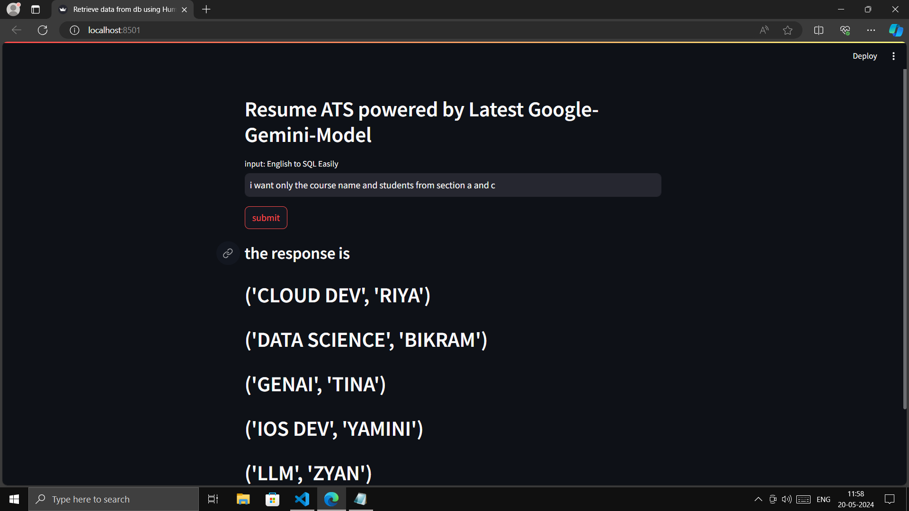
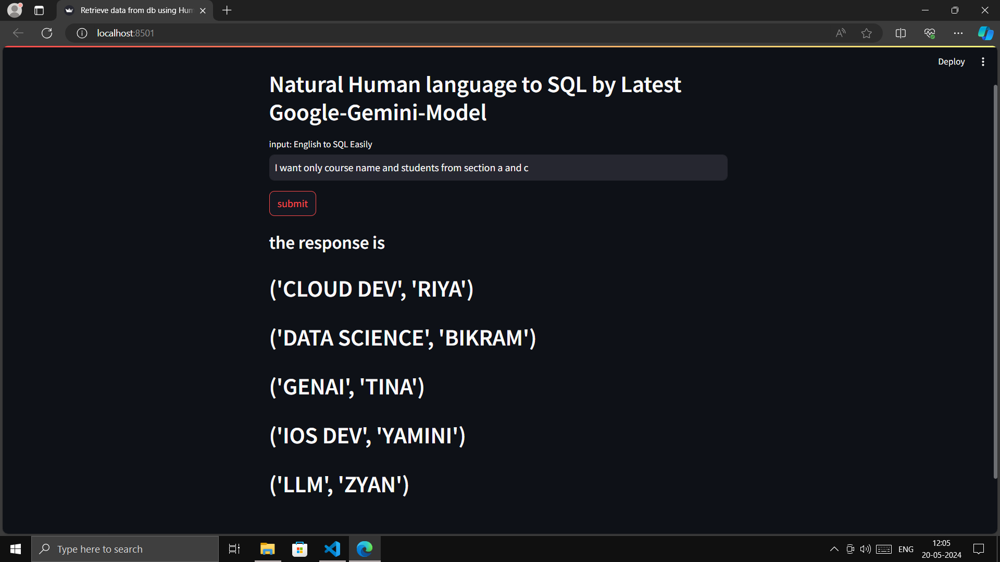
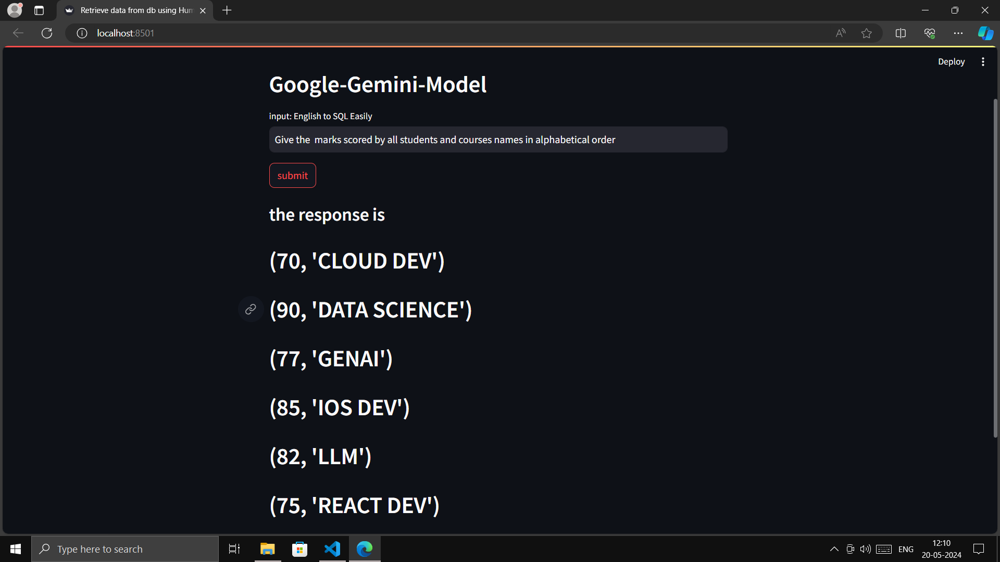

# Natural Language to SQL Query Converter

This project aims to convert natural language queries into SQL queries using the latest Google Gemini model. It utilizes Python, SQLite, and the Streamlit library to create a user-friendly interface for querying a database using natural language.

## Prerequisites

Before running the project, ensure that you have the following dependencies installed:

- Python (version 3.6 or higher)
- SQLite3 (comes pre-installed with Python)
- Streamlit (run `pip install streamlit` to install)
- google.generativeai (run `pip install google.generativeai` to install)
- python-dotenv (run `pip install python-dotenv` to install)

## Setup

1. Clone the repository or download the source code.
2. Navigate to the project directory.
3. Create a new SQLite database file named `student.db` in the project directory.
4. Create a `.env` file in the project directory and add your Google API key with the following format:
GOOGLE_API_KEY=your_api_key_here

## Usage

The project consists of two main files: `sql.py` and `app.py`.

### `sql.py`

This file sets up the SQLite database and inserts sample data into the `STUDENT` table. Follow these steps:

1. Open the `sql.py` file in a text editor or an integrated development environment (IDE).
2. Modify the `table_info` variable to define the structure of your desired table if needed.
3. Update the `cursor.execute` statements with your table name and desired data insertions if needed.
4. Save the changes and run the `sql.py` script.

The script will create the `STUDENT` table and insert sample data into it.

### `app.py`

This file contains the Streamlit application that allows users to input natural language queries and retrieve data from the SQLite database using the Google Gemini model. Follow these steps:

1. Open the `app.py` file in a text editor or an IDE.
2. Ensure that you have set up the `.env` file with your Google API key.
3. Run the `app.py` script using the command `streamlit run app.py` in your terminal or command prompt.
4. The Streamlit application will open in your default web browser.
5. Enter your natural language query in the input field and click the "Submit" button.
6. The application will convert your query into an SQL statement, execute it against the `student.db` database, and display the results.

## Customization

To customize the project for your specific use case, follow these steps:

1. Modify the `table_info` variable in `sql.py` to define the structure of your desired table.
2. Update the `cursor.execute` statements in `sql.py` with your table name and desired data insertions.
3. Modify the prompt in `app.py` to provide the appropriate instructions for the Google Gemini model based on your database schema.
4. Update the `sql_data_retriver` function in `app.py` to handle any additional logic or error handling specific to your use case.

# Contributing

We welcome contributions to this project! If you find any issues or have suggestions for improvements, please feel free to open an issue or submit a pull request. To contribute code changes, fork the repository, create a new branch, make your changes, and submit a pull request. Please ensure that your code adheres to the project's coding standards and conventions.

# Code of Conduct

We aim to maintain a welcoming and inclusive environment for all contributors. Please respect others and their contributions, use inclusive language, and refrain from any form of harassment, discrimination, or unacceptable behavior.

# License

This project is licensed under the MIT License. You are free to use, modify, and distribute the code as per the terms of the license.

# examples

